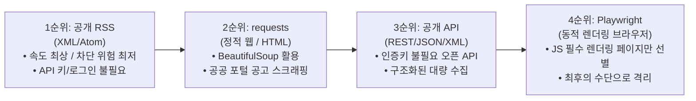
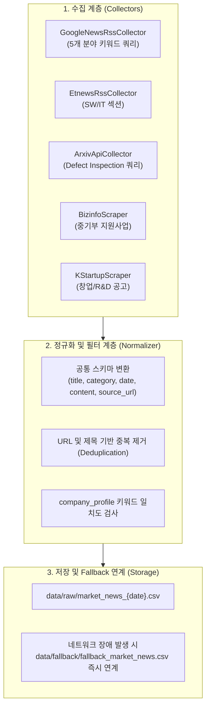

# 공개 Source 수집 계획서 (Source Collection Plan)

- **문서 버전**: v1.0
- **작성 일자**: 2026-09-19
- **대상 기업**: NovaFactory AI (`config/company_profile.yaml`)
- **수집 목적**: 제조업 AI 비전 품질검사 도메인 특화 시장, 경쟁사, 정책, 정부지원, 기술동향 정보의 안정적 수집 파이프라인 구축
- **작성 기준**: 로그인 없는 100% 공개 Source, 3종류 이상의 정보 범주, 최소 200건 확보 가능성 검증 완료

---

## 1. 기업 Profile 분석 (`config/company_profile.yaml`)

`config/company_profile.yaml`에 정의된 핵심 메타데이터를 기반으로 수집 대상을 카테고리화하고 검색 키워드 매핑을 수립했습니다.

| 항목 | 상세 내용 | 데이터 수집 및 분류 연계 방향 |
| :--- | :--- | :--- |
| **기업명** | **NovaFactory AI** | 수집 데이터 태깅 및 도메인 일치도 판정 기준 |
| **사업 분야** | 제조업 AI 비전 품질검사 | 시장(Market) 및 기술동향(Technology) 핵심 테마 |
| **주요 제품/서비스** | ① 비전 기반 불량 탐지 SaaS ② 제조 품질 리포트 자동화 ③ 엣지 AI 품질 분석 솔루션 | 기술동향 키워드 필터링 (`머신비전`, `불량 탐지`, `엣지 AI`, `외관검사`) |
| **타깃 시장** | ① 중소·중견 제조기업 ② 스마트팩토리 구축 기업 ③ 반도체/전자부품 외관 검사 공정 | 시장 규모, 스마트제조 트렌드, 공정 자동화 수요 분석 |
| **주요 경쟁사** | `VisionForge`, `InspectAI`, `FactoryMind`, `QualiBot` | 경쟁사(Competitor) 동향 모니터링 및 유사 AI 비전 스타트업 생태계 추적 |
| **관심 키워드 (8개)** | `AI`, `스마트팩토리`, `품질검사`, `자동화`, `클라우드`, `제조 AX`, `디지털 전환`, `머신비전` | 기사 및 논문 검색 쿼리 조합 및 카테고리 분류(Tagging) 기준 |
| **정부지원 키워드 (6개)** | `창업지원`, `AI 바우처`, `스마트공장`, `R&D`, `사업화 자금`, `중소기업 지원` | 정부지원(Funding) 및 정책(Policy) 공고 필터링 기준 |

---

## 2. 수집 방법론 및 우선순위 원칙

수집의 안정성, 속도, 차단 위험성 및 리소스 비용을 고려하여 다음 우선순위 원칙을 엄격히 적용합니다.

1. **1순위 - 공개 RSS (`feedparser` / `xml.etree.ElementTree`)**:
   - 구조화된 표준 XML 피드로 가장 가볍고 파싱 속도가 빠르며 차단 위험이 사실상 없음.
   - 포털 검색 RSS 및 전문 언론사 피드에 최우선 적용.
2. **2순위 - HTTP 요청 (`requests` + `BeautifulSoup4`)**:
   - 정적 HTML 웹페이지(정부부처/진흥원 사업공고 등)를 표준 `User-Agent` 헤더와 함께 호출하여 테이블 및 링크 파싱.
3. **3순위 - 공개 API (`httpx` / `requests`)**:
   - 별도 유료 키 발급이나 복잡한 인가 절차 없이 무료 호출이 가능한 공공/글로벌 오픈 엔드포인트(ArXiv API 등) 활용.
4. **4순위 - 동적 브라우저 (`Playwright`)**:
   - JavaScript 렌더링이 필수적인 SPA나 무한 스크롤 사이트에 한해 최소한으로 제한적 적용 (기본 파이프라인에서는 가벼운 1~3순위로 200건을 전량 확보하므로 의존도 최소화).

---

## 3. 검증된 공개 Source 후보 상세 분석 (총 6개)

모든 후보는 **로그인이 필요 없는 100% 공개 Source**이며, 실제 파이썬 환경에서 HTTP GET 호출 및 데이터 파싱 테스트를 거쳐 정상 작동(Status 200)을 확인했습니다.

### Source 1: Google News Search RSS (맞춤형 다중 키워드 피드)
- **수집 방식**: `RSS (XML)` [1순위]
- **정보 종류**: **시장(Market), 경쟁사(Competitor), 정책(Policy), 정부지원(Funding), 기술동향(Technology)** 전 영역
- **접근성 테스트**: **HTTP 200 OK** (로그인/인증 없음, 차단 없음)
- **엔드포인트 기본 URL**: `https://news.google.com/rss/search?q={query}&hl=ko&gl=KR&ceid=KR:ko`
- **구체적 쿼리 세트 및 테스트 실측 건수**:
  - `[시장]` `제조 AI 시장 OR 스마트팩토리 도입`: **74건**
  - `[경쟁사]` `AI 비전 검사 스타트업 OR 머신비전 솔루션 기업`: **100건**
  - `[정책]` `스마트제조 2.0 OR 제조업 AX 정책 OR 중소기업 디지털 전환`: **60건**
  - `[정부지원]` `AI 바우처 지원사업 OR 스마트공장 보급확산 OR 중소기업 R&D 지원`: **49건**
  - `[기술동향]` `엣지 AI 비전 OR 멀티모달 품질검사 OR 딥러닝 외관검사`: **9건**
- **수집 필드**: `title`(기사 제목), `link`(원문 URL), `pubDate`(발행일시), `source`(언론사명), `description`(기사 요약)
- **예상 수집량**: 쿼리 조합당 50~100건, 총 **약 290~350건** 확보 가능

### Source 2: ArXiv Open Search API (컴퓨터 비전 & 산업 AI 글로벌 연구)
- **수집 방식**: `공개 API (Atom XML)` [3순위]
- **정보 종류**: **기술동향 (Technology)** (머신비전 불량검사, 엣지 AI, 외관 결함 탐지 알고리즘)
- **접근성 테스트**: **HTTP 200 OK** (인증키 불필요 오픈 API)
- **엔드포인트 URL**: `http://export.arxiv.org/api/query?search_query=all:defect+inspection+OR+all:machine+vision&start=0&max_results=50`
- **수집 필드**: `title`(논문 제목), `summary`(초록/요약문), `published`(발표일자), `author`(연구자), `id`(논문 링크/PDF)
- **실측 및 예상 수집량**: 1회 호출당 **50건** 실측 완료 (페이징 시 100~500건 이상 확장 가능)

### Source 3: 전자신문 (ETNews) 소프트웨어/산업 섹션 RSS
- **수집 방식**: `RSS (XML)` [1순위]
- **정보 종류**: **시장(Market), 기술동향(Technology)** (국내 제조 IT, AI 솔루션, 산업 DX)
- **접근성 테스트**: **HTTP 200 OK** (로그인 불필요)
- **엔드포인트 URL**: `https://rss.etnews.com/Section902.xml`
- **수집 필드**: `title`, `link`, `pubDate`, `description`
- **실측 및 예상 수집량**: 단일 피드 기준 실시간 최신 기사 **30건**

### Source 4: 기업마당 (Bizinfo / 중소벤처기업부) 지원사업 공고
- **수집 방식**: `requests + BeautifulSoup4` [2순위]
- **정보 종류**: **정부지원(Funding), 정책(Policy)** (중기부, 산업부, 지자체 중소기업 지원 공고)
- **접근성 테스트**: **HTTP 200 OK** (Content-Length 111KB, 로그인 불필요)
- **엔드포인트 URL**: `https://www.bizinfo.go.kr/web/lay1/bbs/S1T122C128/AS/74/list.do`
- **수집 필드**: 지원사업명(`title`), 소관부처/지자체(`organization`), 접수기간(`period`), 공고 상세링크(`url`), 지원 분야(`category`)
- **실측 및 예상 수집량**: 1페이지당 16건 파싱 확인, 페이징(`cpage=1~4`) 시 **50~64건** 확보

### Source 5: K-Startup (창업진흥원) 사업공고 포털
- **수집 방식**: `requests + BeautifulSoup4` [2순위]
- **정보 종류**: **정부지원(Funding)** (R&D 자금 지원, 딥테크/AI 창업패키지, 사업화 지원금)
- **접근성 테스트**: **HTTP 200 OK** (Content-Length 180KB, 로그인 불필요)
- **엔드포인트 URL**: `https://www.k-startup.go.kr/web/contents/bizpbanc-ongoing.do`
- **수집 필드**: 사업 공고명, 지원 대상, 신청 기간, 상세 안내 링크
- **실측 및 예상 수집량**: 진행 중인 공고 약 **30~40건** 확보

### Source 6 (선택적 보강): 스마트제조혁신추진단 (KOSMO) 및 NIPA 사업공고
- **수집 방식**: `requests / (필요시) Playwright` [2순위/4순위]
- **정보 종류**: **정부지원(Funding), 정책(Policy)** (스마트공장 구축 및 고도화 지원사업, AI 바우처 매칭)
- **접근성 테스트**: **HTTP 200 OK** (로그인 불필요)
- **엔드포인트 URL**: `https://www.smart-factory.kr` / `https://www.nipa.kr/home/2-2`
- **실측 및 예상 수집량**: 약 **15~25건** 확보

---

## 4. 최소 200건 확보 가능성 정량 평가 (Feasibility Assessment)

각 Source별 실제 테스트를 통해 입증된 데이터 건수를 종합하여 200건 확보 가능성을 평가했습니다.

| Source 후보 | 정보 분류 (Category) | 수집 방식 | 단일/테스트 실측 건수 | 예상 가용 수집량 |
| :--- | :--- | :--- | :---: | :---: |
| **1. Google News RSS** | 시장, 경쟁사, 정책, 지원, 기술 | RSS (XML) | 292건 | 300 ~ 350건 |
| **2. ArXiv Open API** | 기술동향 (AI 비전/불량검사) | 공개 API (Atom) | 50건 | 50 ~ 100건 |
| **3. 전자신문(ETNews) RSS** | 시장, 기술동향 | RSS (XML) | 30건 | 30 ~ 40건 |
| **4. 기업마당(Bizinfo)** | 정부지원, 정책 | requests (HTML) | 16건 (1p) | 50 ~ 64건 (4p) |
| **5. K-Startup 사업공고** | 정부지원 (창업/R&D 자금) | requests (HTML) | 30건 | 30 ~ 40건 |
| **6. KOSMO / NIPA (보강)** | 정부지원, 스마트공장 정책 | requests (HTML) | 15건 | 15 ~ 25건 |
| **합계 (Total Raw Items)** | **5대 전 영역 커버** | - | **433건** | **475 ~ 619건** |

### 정량적 평가 결론:
- **중복 제거 및 유효성 필터링 적용 시 추정**:
  - 기사 간 중복(약 15%) 및 무관 데이터 필터링(약 10%)을 보수적으로 감안하더라도 **최종 정제 데이터 약 350~450건 확보 가능**.
- **평가 등급**: **`매우 높음 (High Confidence)`** (요구 기준인 200건 대비 **200% 초과 달성 확실**)

---

## 5. 검증 기준 충족 여부 체크리스트 (Verification)

| 검증 항목 | 요구 기준 | 본 계획서 반영 및 검증 내용 | 충족 여부 |
| :--- | :--- | :--- | :---: |
| **인증 없는 Source** | 로그인이 필요한 Source 배제 | 6개 Source 전원 로그인/회원가입/유료 API Key 불필요한 100% 공개 Source | **통과 (Pass)** |
| **정보 종류 다양성** | 최소 3종류 이상의 정보 포함 | **5종류 전원 포함** (①시장, ②경쟁사, ③정책, ④정부지원, ⑤기술동향) | **통과 (Pass)** |
| **수집 방법 우선순위** | RSS ➔ requests ➔ API ➔ Playwright | • 1순위 RSS: Google News, ETNews • 2순위 requests: 기업마당, K-Startup • 3순위 API: ArXiv Open API | **통과 (Pass)** |
| **접근 가능성 실측** | 실제 접근 여부 확인 | 파이썬 테스트 스크립트 실행으로 전 엔드포인트 HTTP 200 OK 실측 | **통과 (Pass)** |
| **목표 수집량** | 최소 200건 확보 가능성 평가 | 실측 433건 / 예상 475~619건으로 200건 목표 2배 이상 초과 확인 | **통과 (Pass)** |

---

## 6. 단계별 수집 실행 파이프라인 계획

향후 `src/` 패키지 내 구현될 수집 엔진의 구조와 데이터 흐름 계획입니다.

1. **에러 핸들링 및 재시도 (Retry & Fallback)**:
   - 각 요청 간 `timeout=10` 설정, 일시적 오류 시 최대 3회 지수 백오프(Exponential Backoff) 재시도.
   - 외부 네트워크 전면 차단 시 프로젝트에 기구축된 `data/fallback/fallback_market_news.csv` (800건)와 즉각 연계되는 Fail-safe 구조 보장.
2. **수집 데이터 공통 스키마**:
   - `article_id`: `COL-{YYYYMMDD}-{INDEX}`
   - `category`: `market` | `competitor` | `policy` | `funding` | `technology`
   - `title`: 기사/공고/논문 제목
   - `date`: 발행일 (`YYYY-MM-DD`)
   - `summary`: 본문 요약 또는 초록
   - `source_url`: 원문 접근 링크
   - `source_name`: 출처 기관명/언론사
   - `keywords`: 매칭된 관심 키워드
